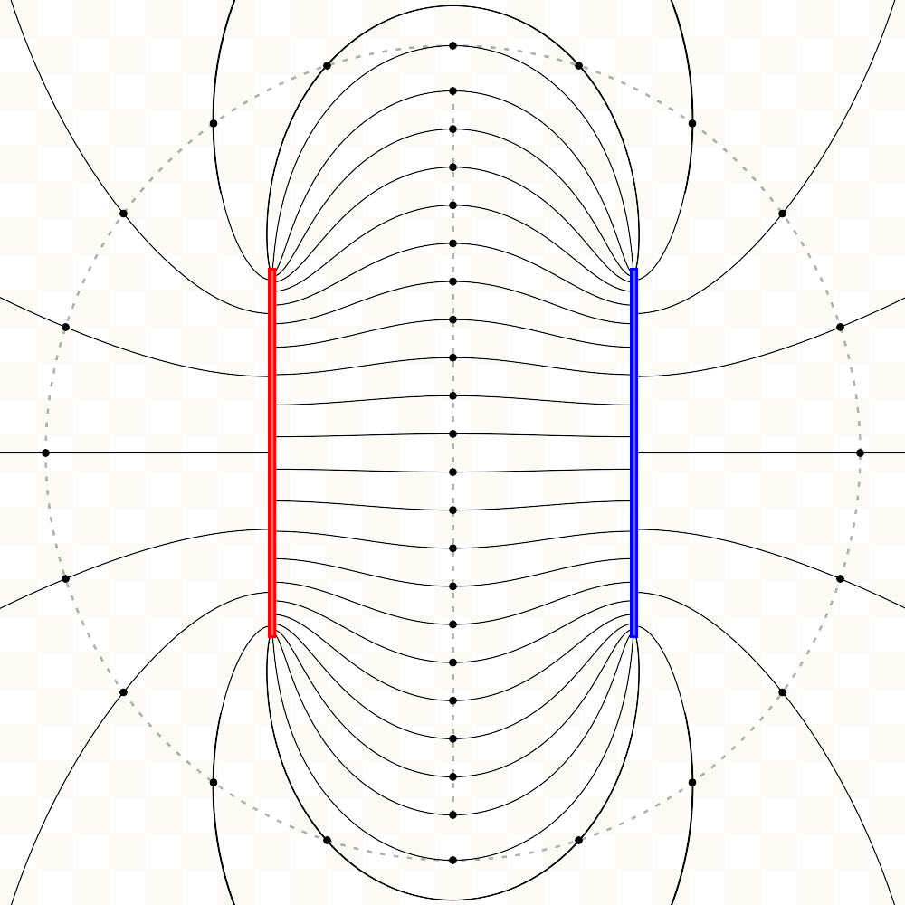

# chargesPHP
Electric field line visualization simulation of point charges and finite line charges.

## Simulation
Uses electric field of point and finite line charge equations.

Finite line charge is not approximated using numerical integration but rather with the direct equation.

Electric field lines however are approximated using Euler numerical integration with a constant step distance and limited by the maximum number of iterations.

## Gallery
### Two positively charged point charges

### Two oppositely charged finite line charges

### Four positively charged finite line charges

